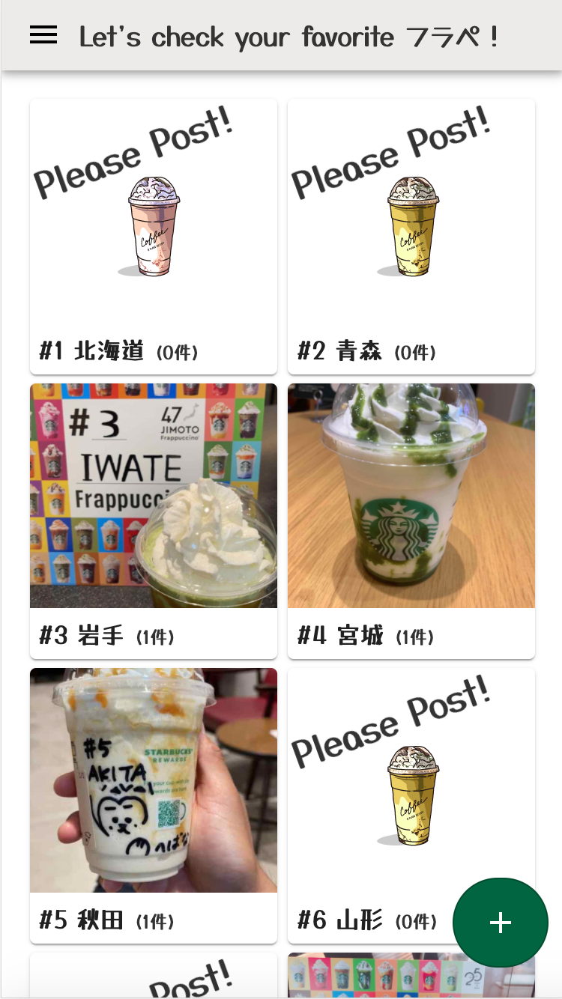
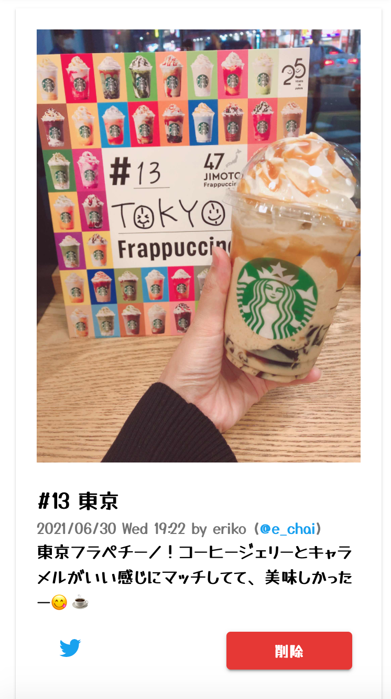

# STARBUCKS 47 JIMOTO Frappuccino 投稿サイト
[sbux-47pref.surge.sh](https://sbux-47pref.surge.sh/)  

  

# このリポジトリについて / About
2021年6月30日から8月3日までの期間限定で始まった [STARBUCKS JAPAN 47JIMOTO フラペチーノ](https://www.starbucks.co.jp/cafe/jimoto_frappuccino/)  
このフラペチーノの画像を投稿するサイトの **バックエンド** のリポジトリです。  

▶️ 管理用メインリポジトリは [こちら](https://github.com/nouvelle/sbux-47pref)  
▶️ フロントエンドは [こちら](https://github.com/nouvelle/sbux-47pref-front)  

# 構成 / Architecture


# 開発方法 / Development
## Amazon S3 のバケット作成
本サービスでは、アップロードされた画像データを Amazon S3 にアップロードしています。  
S3 にバケットを作成したら、env ファイルに必要な情報を定義してください。  

## Twitter API の設定
本サービスでは、投稿データを Twitter で自動ポストしています。  
Twitter の Developer 登録が完了したら、env ファイルに必要な情報を定義してください。  

## .envファイルの作成(初回のみ)
envファイルをサンプルからコピーします。  
値は自分の環境に合わせて適宜設定してください。
```bash
$ cp .env.sample .env
```

```
# サーバ起動に関する定義
PORT=

# Database に関する定義 (Postgresデータベースを使用します)
DB_HOST=localhost
DB_PORT=5432
DB_DATABASE=
DB_USERNAME=
DB_PASSWORD=
DB_LOGGING=

# 画像ファイルをアップロードするための Amazon S3 に関する定義
AWS_ACCESS_KEY=
AWS_SECRET_KEY_DEV=
AWS_BUCKET=

# Twitter に投稿するための Twitter に関する定義
TWITTER_CONSUMER_KEY=
TWITTER_CONSUMER_SECRET=
TWITTER_ACCESS_TOKEN_KEY=
TWITTER_ACCESS_TOKEN_SECRET=
```

## 起動方法
```bash
# 1. このリポジトリを clone する
$ git clone https://github.com/nouvelle/sbux-47pref-back

# 2. clone したリポジトリに移動する
$ cd sbux-47pref-back

# 3. パッケージをインストールする
$ npm i

# 4. データベースを作成したら、マイグレーションを実行してデータベースを設定する
$ npm run migrate

# 5. 初期データを追加する(初回のみ)
$ npm run seed

# 6. アプリを起動する(開発時)
$ npm run start:dev
```

## その他コマンド
```bash
# マイグレーションのロールバック
$ npm run rollback

# マイグレーションファイルの作成
$ npm run makeMigration [マイグレーションファイル名]
```

## Swagger
APIについては、以下のURLで確認してください。
```
http://localhost:5001/docs/
```

# コントリビューション / Contributing
みなさんからの Issues & Pull requests 大歓迎です！ 😊

## Issue レポート
バグ報告、新規機能の要望やご提案など、[当リポジトリの Issues](https://github.com/nouvelle/sbux-47pref-back/issues) をご活用ください。

## Pull Request(PR)
PR は、個別のブランチを切って作業してください。原則、PRは main ブランチを対象としてください。


# ライセンス / License
[MIT](https://choosealicense.com/licenses/mit/)
